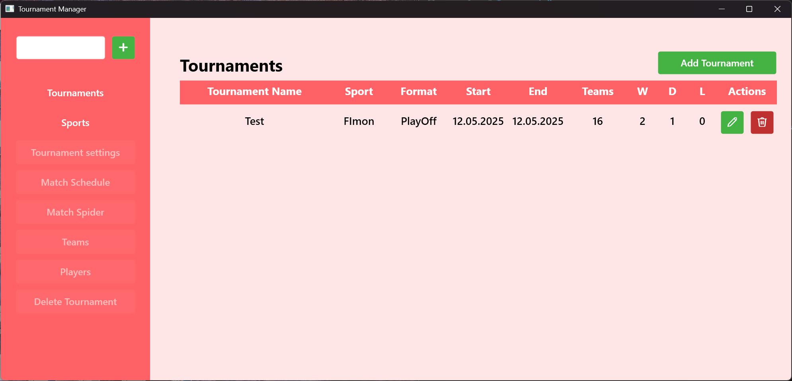
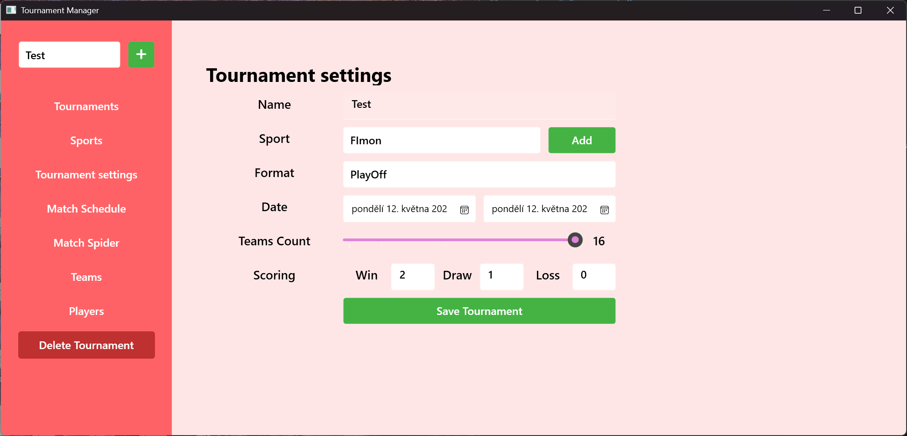
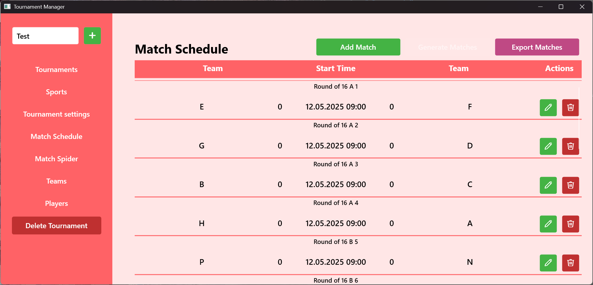
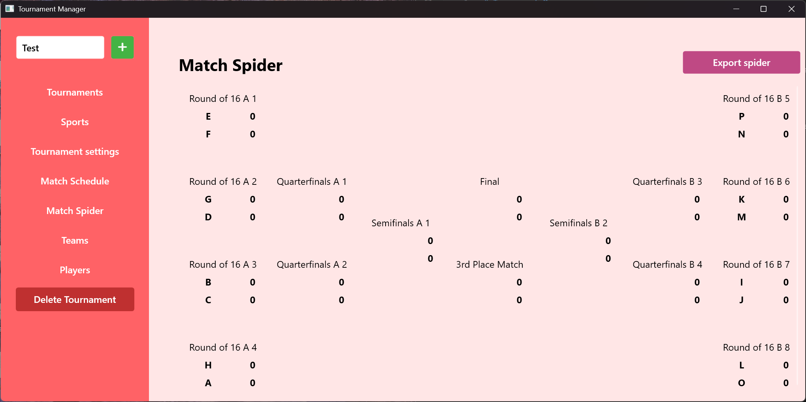
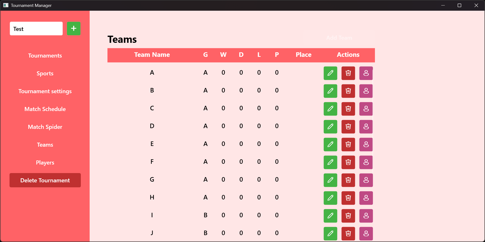

# Tournament Manager

Author : Nikol Otáhalová
Subject : PV178 Faculty of informatics, Masaryk University

AI: Copilot was used to help with export to PDF,
and to help me understand how the hell DB works,
since I always focus more on the Front End,
and with certain features of WPF, which helped me to create custom Data Tables

Setup:
In order to run Local Microsoft SQL Databse is needed, recommended to run in IDE. Then run /Project/Data/createDB.sql to prepare the database.

Screenshots:

